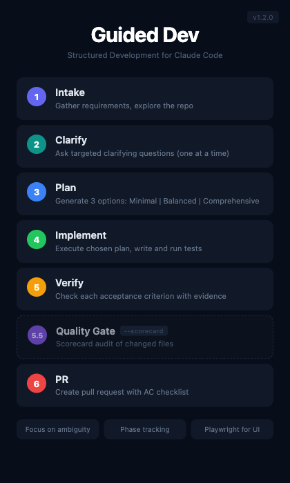

# Guided Dev

A structured development workflow plugin for Claude Code that guides tasks through intake, clarification, planning, implementation, verification, and PR creation.



## Quick Start

```
/guided-dev
```

Or with an inline task description:

```
/guided-dev Add a rate limiter to the /api/users endpoint
```

## Phases

```
Phase 1   — Intake        Gather requirements, explore the repo
Phase 2   — Clarify       Ask targeted clarifying questions (one at a time)
Phase 3   — Plan          Generate 3 implementation options (Minimal / Balanced / Comprehensive)
Phase 4   — Implement     Execute the chosen plan, write and run tests
Phase 5   — Verify        Check each acceptance criterion with evidence
Phase 5.5 — Quality Gate  Scorecard audit of changed files (opt-in, --scorecard)
Phase 6   — PR            Create a pull request with acceptance criteria checklist
```

## Arguments

| Flag | Description | Default |
|------|-------------|---------|
| `<task description>` | Inline task description (positional) | Prompted in Phase 1 |
| `--resume <phase>` | Resume from a specific phase | Start from Phase 1 |
| `--skip-clarify` | Skip the clarification phase | Off |
| `--max-questions <n>` | Max clarifying questions | 20 |
| `--no-pr` | Stop after verification, skip PR creation | Off |
| `--simplify` | Run `/simplify` on changed files after implementation | Off |
| `--scorecard` | Run quality gate after verification (security, testability, maintainability on changed files) | Off |

### Resume Values

`intake`, `clarify`, `plan`, `implement`, `verify`, `scorecard`, `pr`

## Usage Examples

```bash
# Start a new workflow with a task description
/guided-dev Fix the pagination bug in the search results page

# Skip clarification for a well-defined task
/guided-dev --skip-clarify Add a health check endpoint at /health

# Limit clarifying questions
/guided-dev --max-questions 5 Refactor the auth middleware

# Resume from implementation after a context reset
/guided-dev --resume implement

# Full workflow without PR creation
/guided-dev --no-pr Prototype the new dashboard layout

# Run simplify pass on changed files
/guided-dev --simplify Refactor the data pipeline

# Run quality gate before PR (audits changed files for security, testability, maintainability)
/guided-dev --scorecard Add payment processing to checkout
```

## Skills

| Skill | Purpose |
|-------|---------|
| `intake` | Repo exploration and requirement gathering |
| `clarify` | Targeted clarifying questions with multi-choice options |
| `plan` | Three-option plan generation (Minimal / Balanced / Comprehensive) |
| `verify` | Acceptance criteria verification with evidence |

## How It Works

The `/guided-dev` command acts as an orchestrator that delegates to specialized skills for each phase. Cross-cutting rules enforce consistency:

- **Phase tracking** — each phase is announced; ask "where are we?" at any time
- **Pause on ambiguity** — Claude stops and asks rather than guessing
- **Playwright for UI** — browser-based verification for UI tasks
- **Walkthrough on demand** — ask for a walkthrough of changes at any point
