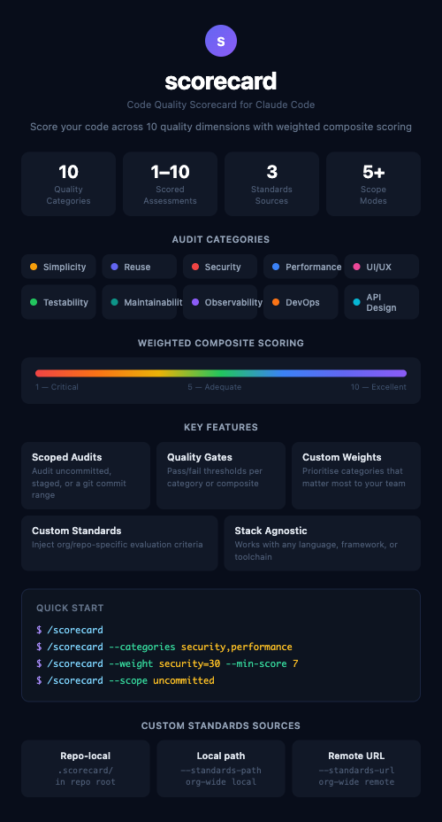

# Scorecard

Score your code across 10 quality dimensions — each scored 1-10, rolled into a weighted composite. Run a full codebase scorecard, scope to recent changes, set pass/fail quality gates, and inject org-specific scoring criteria. Works with any language or framework.



## Quick Start

```
/scorecard
```

## Available Categories

| Directory | Display Name | Flag Value |
|-----------|-------------|------------|
| `audit-simplicity` | Simplicity | `simplicity` |
| `audit-reuse` | Reuse | `reuse` |
| `audit-security` | Security | `security` |
| `audit-performance` | Performance | `performance` |
| `audit-ui-ux` | UI/UX | `ui-ux` |
| `audit-testability` | Testability | `testability` |
| `audit-maintainability` | Maintainability | `maintainability` |
| `audit-observability` | Observability | `observability` |
| `audit-devops` | DevOps Readiness | `devops` |
| `audit-api-design` | API Design | `api-design` |

## Usage

```bash
# Full audit with equal weights
/scorecard

# Audit specific categories only
/scorecard --categories security,performance

# Weighted audit with quality gate
/scorecard --weight security=30 --min-score 7

# Fail if any category drops below threshold
/scorecard --min-category-score 5

# Audit only uncommitted changes
/scorecard --scope uncommitted

# Audit only staged changes
/scorecard --scope staged

# Audit changes from the last 3 commits
/scorecard --scope HEAD~3

# Audit changes between branches
/scorecard --scope main..feature-branch

# Combine scope with category filters
/scorecard --scope uncommitted --categories security,performance

# Merge org-wide standards from a local directory
/scorecard --standards-path ../company-standards/scorecard/

# Merge org-wide standards from a remote URL
/scorecard --standards-url https://raw.githubusercontent.com/AcmeCorp/standards/main/scorecard/
```

## Custom Standards

Organizations and individual repos can inject their own evaluation criteria that get merged into the audit.

### Standards Sources (in precedence order)

| Source | Mechanism | Scope |
|--------|-----------|-------|
| Repo-local | `.scorecard/` directory in repo root | Repo-specific |
| Local path | `--standards-path <dir>` | Org-wide (local) |
| Remote URL | `--standards-url <url>` | Org-wide (remote) |

### Setup

1. Create a `.scorecard/` directory in your repo root
2. Add `<category>.md` files for categories you want to augment:

```markdown
# Security -- Acme Corp Standards

## Additional Criteria
- All services MUST use @acme/auth-middleware for authentication [CRITICAL if missing]
- PII fields must be annotated with @PiiField decorator [MAJOR if missing]
```

3. Optionally add `config.md` for default weights, skip rules, or thresholds
4. Commit -- the next `/scorecard` run automatically picks up your criteria

## Contributing & Extending

### Extension Points

| What you want to do | How | Effort |
|---|---|---|
| Add org/repo-specific criteria | Drop a `.scorecard/<category>.md` file | Minutes |
| Add tech-specific deep-dives | Add a `references/<stack>.md` file to the relevant skill (v2) | ~1 hour |
| Add a new audit category | Create a new `audit-<name>/SKILL.md` skill and register in orchestrator | Half day |
| Modify scoring/reporting | Edit the orchestrator command (`scorecard.md`) | Varies |

### Adding a New Category

1. Create `skills/audit-<name>/SKILL.md` following the existing skill template
2. Create `skills/audit-<name>/references/` directory
3. Register the category in `commands/scorecard.md` (name mapping, wave assignment, weight table)
4. Test independently before running via `/scorecard`

### Guidelines

- **Criteria must be observable** -- describe something concrete that can be found by scanning the codebase
- **Severity must be justified** -- CRITICAL means real risk; when in doubt, use MAJOR
- **Include what to look for and how to assess** -- explain what good vs bad looks like
- **Test on real repos** -- run the audit on 2-3 repos of different sizes/stacks before submitting
- **Keep criteria count reasonable** -- 5-15 criteria per category
